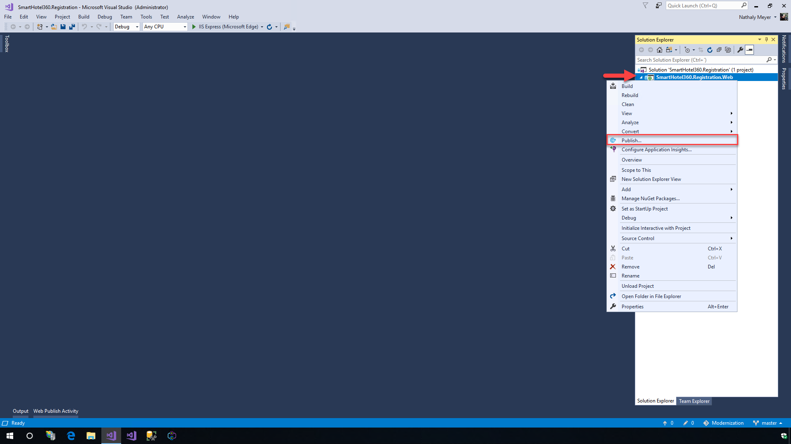
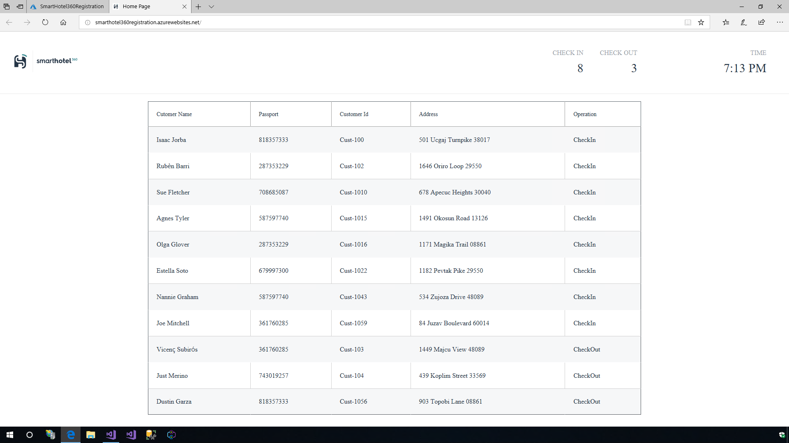
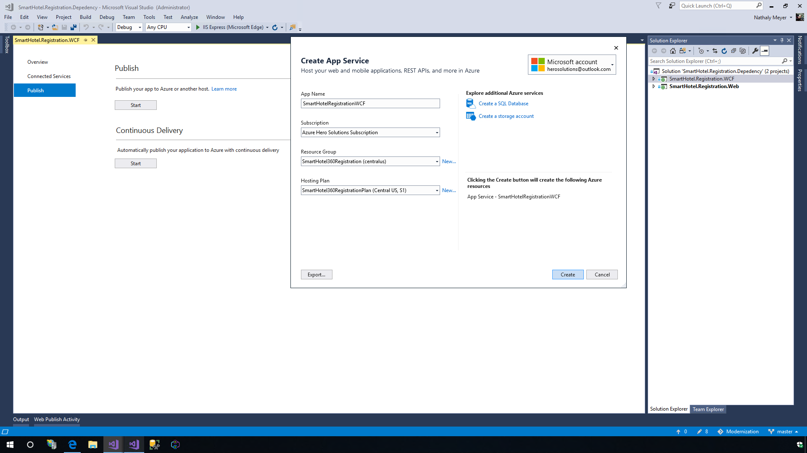
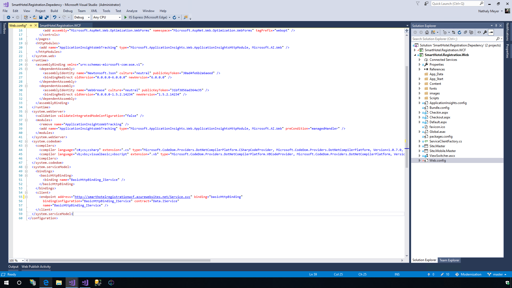
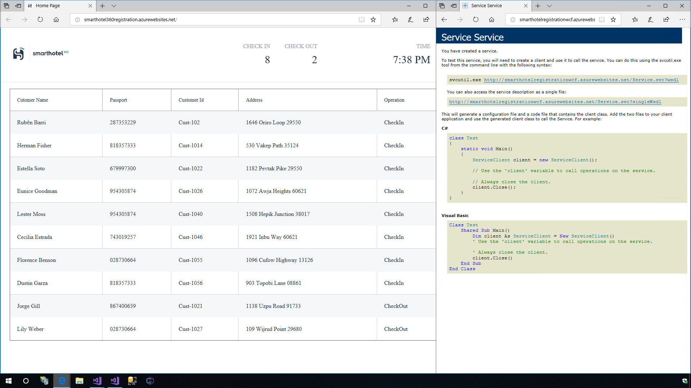
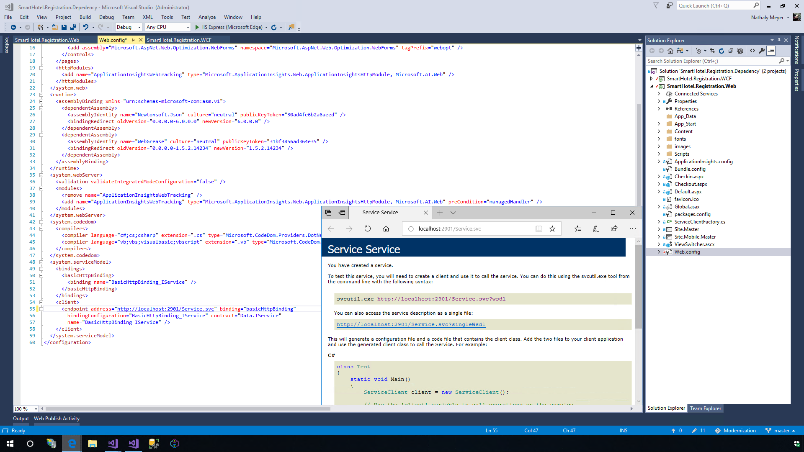
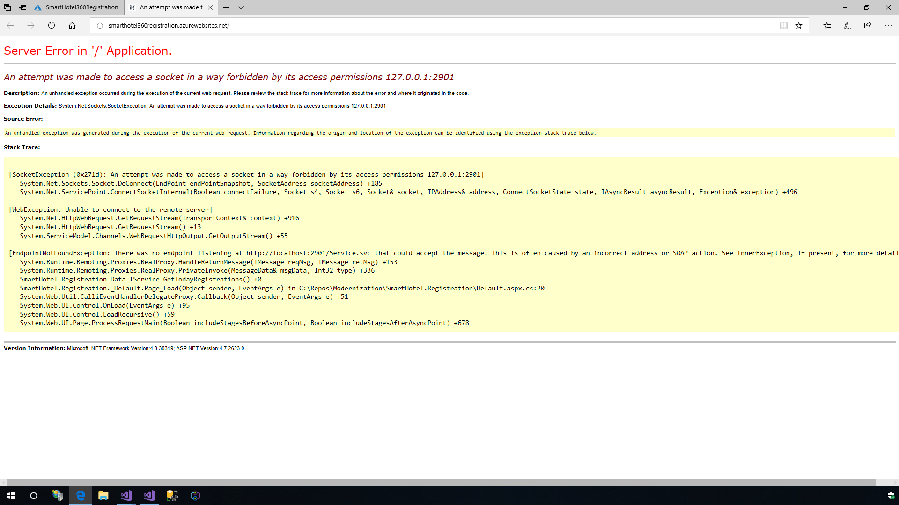
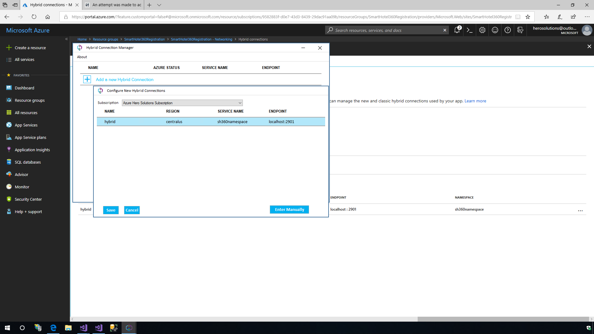

# Introduction 
Azure App Service is a service for hosting web applications, REST APIs, and mobile back ends. You can develop in your favorite language, be it .NET, .NET Core, Java, Ruby, Node.js, PHP, or Python. Applications run and scale with ease on Windows-based environments. For Linux-based environments. Web Apps adds the power of Microsoft Azure to your application, such as security, load balancing, autoscaling, and automated management. 

Azure makes it very easy to modernize your application portfolio. With Azure App Service, you can easily migrate your existing .NET applications with very minimal effort. In this demo, we will show you different scenarios in which how you can bring a ASP.NET WebForms based application that is currently running on-premise to Azure App Service. 

# Demo Scenario

This demo is based on SmartHotel360, which is a fictitious smart hospitality company. Due to the complexity of managing the local infrastructure, SmartHotel360 wants to re-host their web app with the less effort possible to Azure and take advantage of Platform as a Service (PaaS).

1. Simple web app running on local IIS connected to a local SQL Server database. For this scenario we are going to create the resources in Azure and the publish the website and the database. 
1. Website with a WCF service dependency connected to SQL Server database. In this scenario we are going to publish the website, the WCF service and the database. This WCF service is using BasicHttp binding and without authentication.
1. Website with a WCF service dependency connected to SQL Server database but in this case SmartHotel360 only wants to re-host the website and leave the WCF service and SQL Server running on-premises. 


# Getting Started
There are many ways you can create and deploy the Azure resources for you app, you can create the resources in the Azure Portal or you can use Visual Studio. For this demo we are going to use Visual Studio Publishing Tool.

1. Lets logging into the Virtual Machine with the following credentials:

```
Username: Modernization\herosolutions 
Password: Pa$$w0rd!
```

2. Lets clone the repo of our solution for this we can use the shortcut in the desktop called **Clone** or we can use the following command. Once cloned, use the shortcut in the desktop to open the solution called **SmartHotel360.Registration** or navigate to **C:\Repos\Modernization**

```
git clone https://azuredemosolutions.visualstudio.com/Modernization/_git/Modernization
```


# Deploy to Azure

3. Now lets **right-click** on the web project and click on **publish**.



4. In the left menu we are going to use **App Service**, in case we have one already created we can use Select Existing for this case we are going to use **Create New**. Lets click on **Publish**.


5. We need to specify the name of the App, select the subscription, select or create a new Resource Group and select or create a Hosting Plan. In this case we used the following information:

```
App Name: SmartHotel360Registration
Subscription: Azure Hero Solutions Subscription
Resource Group (New): SmartHotel360Registration
Hosting Plan (New):
    - App Service Plan: SmartHotel360RegistrationPlan
    - Location: Central US
    - Size: S1
```


6. Since this app connects to a database we will need to click on **Create a SQL Database**, here we will need to provide the database name, create a new SQL Server and provide the credentials (username and password) for our SQL Server, we are going to use the default name for the connection string called **DefaultConnection**. Once we have completed the information we can go ahead and click Ok and then Create, this tool will connect to Azure, provide the resources and then publish the web project in the App Service. Note: In this demo we are using data sample generators so the blank database will be populated automatically the first time we open the website, you can take a look at the code for more details.


# Exploring the Azure App Service

7. Once we have deployed our app in Azure App Service the website will open automatically. 



8. Lets take a look at the several advantages of hosting web app on Azure. For this we will open the Azure Portal. Open the first tab of the Edge browser. You can also use the following URL: [https://portal.azure.com ](https://portal.azure.com)


9. Once in the Azure Portal open the **Resource Group** you created with the Visual Studio Publishing Tool. Here you will see the resources created.


10. Select the App Service in this case our App Service is called **SnartHotel360Registration**

## Global scale with high availability

One of the most challenges things when we have to manage infrastructure is setting up the scalability needed for our apps. Business should run without systems failures no matter how can it grow. With App Services you can scale up or out, manually or automatically. Host your apps anywhere in Microsoft's global datacenter infrastructure, and the App Service SLA promises high availability.

11. In the left menu of the App Service, under **Settings** we will find the option of **Scale Up**, this will show us the different tiers available for our App Services.


12. We can choose the **Scale Out** option in the left menu and click on **Enable autoscale**, we need to provide an autoscale setting name and create a rule, for this scenario we are going to use the default rule, if the CPU percentage is greater than 70% add an additional instance. We can define up to 10 maximum instances. We can now click on **Save** and now our app is enabled to autoscale.


## Security and compliance

App Modernization requires security and compliance and Azure App Service provides ISO, SOC, and PCI compliant.  We can choose to authenticate users with Azure Active Directory or with social login (Google, Facebook, Twitter, and Microsoft). Create IP address restrictions, manage service identities, add custom domains and SSL to your apps, as well backups you can  create restorable archive copies of your apps content, configuration and database.

13. In the left menu of the App Service we can find the Authentication / Authorization option where we can setup each identity provider or anonymous access.


14. In the left menu we can also find the BackUps option where we can configure the Snapshot and Backup configuration.


15. In the left menu we can click on SSL settings to setup the certificates and TLS.


## DevOps optimization

 Setting up a Continuous Integration and Continuous Deployment (CI/CD) with Visual Studio Team Services, GitHub, BitBucket, Git, FTP, Dropbox or OneDrive have been never so easy. Azure App Services will setup the right configuration for your build definitions from your source control to your Azure App Service with the Build Provider.

 16. In the left menu we can setup the CI/CD pipeline in Deployment options or Deployment Center. Here we can find many source controls and build providers.

 
 
 ## Application Insights

Monitoring is a big part of App Modernization - understanding which features are the most used, which pages are the most visited or what is causing the most failures will help the development team to focus more on those elements. Application Insights is an extensible Application Performance Management (APM) service for web developers on multiple platforms. Use it to monitor your live web application. It will automatically detect performance anomalies. It includes powerful analytics tools to help you diagnose issues and to understand what users actually do with your app.

17. To add Application Insights to your apps you can either use the option in the left menu of your App Service or you can use Visual Studio. Just click your web project and click on **Configure Application Insights**.


18. Make sure the SDK is updated if not click on **Update SDK** and then click on **Get Started**, provide the resource name and click on **Register**. You can also click on **Configure Settings** to specify the Resource Group and Location. Now you can re-publish your app with the profile we already created.


19. When you re-publish your application you can see that live data is been receiving from your app in Azure App Service. Also, in the Azure Portal you can find a new Application Insight resource, there you will find all the metrics of your app including Failures, Performance Availability, etc. Also you can configure alerts, export, Work Items, etc.


## Snapshot Debugger for .NET
Debugging apps can be difficult specially if the app is running on production with  Snapshot Debugger you can take a snapshot of your in-production apps when code that you're interested in executes. The debugger lets you see exactly what went wrong, without impacting traffic of your production application. The Snapshot Debugger can help you dramatically reduce the time it takes to resolve issues that occur in production environments.

20. Right-click on the web project and click on **Manage Nuget Package** we need to include **Microsoft.ApplicationInsights.SnapshotCollector** in our web project. 

 

21. We will need to introduce a bug in the code, so we need to open the class in the code behind of the page **Check In** page and comment the line number 19 and uncomment line 20. so the code will look like this:

```
//int.TryParse(Request.QueryString["registration"], out int registrationId);
int.TryParse(Request.QueryString["registrationId"], out int registrationId);
```

This will throw an ArgumentException in the line 23 so a new exception will store in the Application Insights and we will be able to download the snapshot for that exception. 

 

 22. We can go ahead and re-publish the web project with the profile created. Once the website is running you can click on **CheckIn** and you will see the ArgumentException exception error that we just created.

  

23. In the Application Insights Service in Azure Portal we can navigate to **Failures** and open the exception with the error **System.ArgumentException**.

 

24. We can click on **Open debug snapshot** then we can click on **Download Snapshot**.

 

25. Open **Visual Studio Enterprise 2017** and then open the solution **SmartHotel360.Registration**, we can go ahead and open the file we just downloaded, then click on **Debug with Managed Only** this will put Visual Studio in debug mode and then click on **Continue Debugging** then you can see when the Argument Exception was executed.

 

You can also use **Snappoints** and **Logpoints** to make it easy to debug in production. Snappoints are like breakpoints in that they allow you to take snapshots of a system when a given line is executed, but without actually noticeably pausing the execution of the application. Logpoints work in the same way, except that they allow you to inject custom logging into production apps on the fly.

26. Use the Cloud Explorer and navigate to the App Services in Azure, right-click on the website and select create a snappoint in the similar way than a breakpoint, this will debug remotely the App Services without affecting the runtime of it. However you may need to reset the App Service in order to enable the snappoint.

 

# Deploying different scenarios
You app portfolio can include different architectures and in this demo we are going to show how Azure App Service can host different scenarios: 

## Publishing a WCF in Azure App Service

Azure App Services also provide support for most of the WCF services, to demonstrate this we are going to show the second scenario which includes a WCF service with HttpBinding connected to a SQL Server Database. To deploy this we will need another App Service for the WCF service. In this case we can use the same App Service Plan that we already have for our website. 

27. We will need to open the solution called **SmartHotel.Registration.Depedency** located in the desktop. Once open right-click on the WCF project and click on **Publish**. In the **App Service** option click on **Create New** and then **Publish**, we just need to create an App Service, we can select the existing Resource Group and Hosting Plan. Then click on **Create**.

 

 28. Once created the profile and published the WCF in the App Service we need to go back in Visual Studio and click on **Configure** to change the string connection of the database. Click on **Next** and then click on the three dots of **DefaultConnection** then specify the Server name, credentials and the database name we created in the step 6. You can also click on **Test Connection** to make sure it's connected. Then we can go ahead and click on **Save** and then **Publish** again.

   

29. Before publishing the web project we need to change the URL of the WCF, open the **web.config** file inside the web project (SmartHotel.Registration.Web) and paste the new URL in the line 55 then save the file.



30. Lets right-click on the web project and click on **Publish** in the App Service menu use the option **Select Existing** and then click on **Publish** then select the App Service we created for the previous solution and click **OK**.


We now have the website connected to the WCF Service in the App Service we created and now the WCF is handling the connection to the SQL Database.



## Using a Hybrid Connection

One of the biggest advantages of App Service is the availability to use Virtual Networks or Hybrid Connections to communicate with resources running On-premises. For the third scenario we can't move the service and database yet because other on premises applications have a dependency, in this case SmartHotel360 only wants to move their website to Azure but not their WCF and database.

31. In the web project we need to change back the URL of the WCF service in the **Web.config** file in line 55 and pointing to http://localhost:2901, where we have hosted our On-Premise WCF service.



32. We can save the file and re-publish the web project with the same profile we used in the scenario before. We will get an error because the website can't connect to the WCF in the local IIS server.



33. To solve this we will use the Hybrid Connection. Lets navigate in the App Service and under Settings click on **Networking**. Then click on **Configure your hybrid connection endpoints**, here we can download the Hybrid Connection Manager but in this VM we already have it installed, so, lets click on **Add hybrid connection** then **Create ew hybrid connection**, here we need to provide the Hybrid connection Name, Endpoint Host, Endpoint Port and Create or Select a namespace. For this case we want to connect to Localhost in the port 2901 and create a new namespace.


34. Once the connection is registered, we need to open the **Hybrid Connection Manager** tool and login in order to have access to the registered hybrid connections in our Azure subscription, use the following credentials:

```
Username: herosolutions@outlook.com
Password: Pa$$w0rd2018!
```

Choose the subscription and then select the connection we just registered, click on save, then you can click on **Refresh** in the Azure Portal Hybrid Connections and it will show the connection is also connected from the Azure side.



35. We now can refresh the website and now it's connected to the WCF in the localhost through the Hybrid Connection of the App Service.


# Summary

Azure App Service enables you to Modernize your app portfolio in a very easy and painless way. You can build and host web applications in the programming language of your choice without managing infrastructure. It offers auto-scaling and high availability, supports both Windows and Linux, and enables automated deployments from GitHub, Visual Studio Team Services, or any Git repo. Get started [here with Azure App Service](https://azure.microsoft.com/services/app-service).