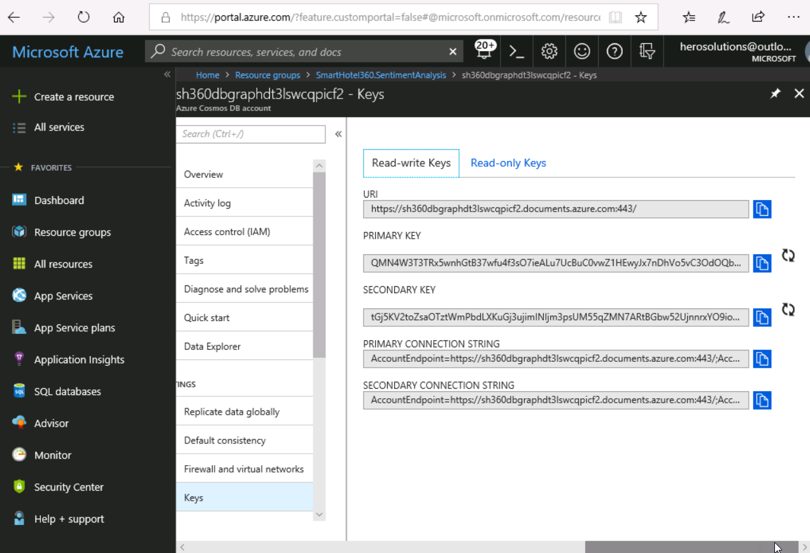

# Cloud Native with Serverless

## Version: 2018.1
## Author: David Sanchez
## Level 200
## Duration: 1 hour

# Overview 
 
Azure offers a comprehensive set of cloud platform services that make it easy to navigate architectural approaches and design patterns for building modern apps. It delivers numerous options for application development and deployment. In addition, serverless architecture, a popular choice for cloud native applications, includes: 
* Event-driven functions, without the need to explicitly provision or manage infrastructure with **Azure Functions**
* Globally distributed, multi-model databases with **Azure Cosmos DB**.
* Highly available and redundant storage with **Azure Storage**. 
* More than 200 out-of-the-box connectors using **Logic Apps** to integrate apps, data, systems, and services.
* Use **Event Grid** to power your event-driven and serverless apps.

# Key Takeaway

In this demo, we are showing the capabilities and advantages of building cloud native apps in Microsoft Azure. 

This demo is based on SmartHotel360, which is a fictitious smart hospitality company showcasing the future of connected travel.

In this scenario, we have developed a website in Node.js to analyze customer sentiment from Twitter by using Text Analysis Cognitive Services APIs. This website was developed with Visual Studio Code and uses Azure services like Cosmos DB, Functions, and Logic Apps.


## Exercise 1: Getting Started

1. Login to the Virtual Machine with the following credentials:

    ```
    Username: CloudNative\herosolutions 
    Password: Pa$$w0rd!
    ```

1. Double click the **Clone Repo** shortcut icon on Desktop to clone the repository of the SmartHotel360 solution. 

   Alternatively, use the following command:

    ```
    git clone https://azuredemosolutions.visualstudio.com/CloudNative/_git/CloudNative
    ```

    

1. Launch **Visual Studio Code** and open the repository that was cloned. Open the **arm** folder within the Visual Studio Code editor under the path **C:\Repos\CloudNative**.

1. Click the PowerShell script file called **Deploy-AzureResourceGroup.ps1** and notice the PowerShell Integrated Console terminal will show up automatically at the bottom of the Visual Studio Code editor. 

   Type the command **.\Deploy-AzureResourceGroup.ps1**, hit **Enter** and wait for the execution to complete. 

    >It can take up to 3 minutes to complete the script execution.

    ```
    PS C:\Repos\CloudNative\arm> .\Deploy-AzureResourceGroup.ps1
    ```

   

## Exercise 2: Azure Resources Configuration

With the script execution, a resource group with all the services required for this demo app is created.

1. Launch the **Microsoft Edge** browser and notice that the created Resource Group **SmartHotel360.SentimentAnalysis** is displayed in the Azure Portal.

1. Click the **Graph** cosmos db (which starts with sh360dbgraph*******) from the resources list and click the **Data Explorer** option. Click the **New Graph** button, provide **TweetsDB** as the new Database Id, Graph Id as **Tweets**, choose the storage Capacity as **Fixed (10 GB)** and click **OK**. Close the Data Explorer window to navigate back to the resource group.

    

    > **Talk track:** We have to create a database and collections in both Cosmos DBs.

1. Click the **SQL** cosmos db (which starts with sh360dbsql*******) from the resources list and click the **Data Explorer** option. Click the **New Collection**, provide **TweetsDB** as the new Database Id, Collection Id as **Tweets**, choose the storage Capacity as **Fixed (10 GB) ** and click **OK**. Close the Data Explorer window to navigate back to the resource group.

    

## Exercise 3: Configuring Azure Logic App

1. Click the created Logic App from the resource group list and click the **Logic App designer** option from its menu list.

1. Select the common trigger **When a new tweet is posted** and then click on the **Sign in** button in the Twitter trigger with the following credentials:

    ```
    Username: MeyerNathaly
    Password: Pa$$w0rd2018!
    ```

    

1. Click the **Continue** button to define the hashtag as **#SmartHotel360** which needs to be monitored and click on **Edit** next to *Using the default values for the parameters* to modify the frequency to **3 seconds**.

    

1. Click the **New step** button and then the **Add an action** button. Type **Cosmos** in the search bar and select the option **Azure CosmosDB - Create or update document**.

    


1. Provide the connection name as **CosmosDBConnection**, select the SQL API Cosmos DB (it starts with sh360dbsql*******) and click the **Create** button. 

1. Select the **TweetsDB** option for Database ID, **Tweets** for Collection ID and paste the following code in the **Document** text box. Click the **Save** button at the top of the Logic App Designer window and then click **Run**. Notice that a notification **Successfully checked the trigger** appears every 3 seconds in the Azure portal notification pane.

    ```
    {
        "created": "@triggerBody()?['CreatedAtIso']",
        "id": "@triggerBody()?['TweetId']",
        "text": "@triggerBody()?['TweetText']",
        "user": "@{triggerBody()?['TweetedBy']}"
    }
    ```

   

## Exercise 4: Configuring Azure Functions

1. In the Visual Studio Code editor, open the **Functions** folder which is under the path **C:\Repos\CloudNative**. 

1. Click the **local.settings.json** file and provide the string connections for Azure Storage, Cosmos DB (SQL API). We will find these connections strings in the Azure Portal.

   Alternatively, click the **Azure icon** in Visual Studio Code editor. It takes 1-3 minutes to load the data. Expand the **Azure Hero Solutions subscription** under **Functions, Storage, Cosmos DB (SQL API)** windows, right click the created resource and click **Copy Connection String** to copy the Connection Strings. Paste the values appropriately in the json file.  

    

1. For Cognitive API key, navigate back to the resources list and click the **Coginitive Services** resource (starts with sh360cognitive...), click the **Keys** option in the menu, copy the **Key 1** value and paste the value for the **COGNITIVE_SERVICES_API_KEY** variable. Save and close the file.

    
    

1. Click the **dbconfig.js** file located in the        **AnalizePendingTweet** folder under the Explorer to see its content. Navigate to Graph API Cosmos db resource and click **Keys** option to copy the **URI** and **Primary Key** values and paste it in the dbconfig file. Save and close the file. 

   > The endpoint value must not include the protocol (https://) and the port number. 

     

    

1. In the **Integrated terminal (View menu)** window of the Visual Studio Code Editor, execute the following command: 

    ```
    func extensions install --package Microsoft.Azure.WebJobs.Extensions.CosmosDB --version 3.0.0-beta7
    ```

    

    > **Talk Track :** We have to configure the database connection to the Cosmos Graph DB (Gremlin), install the Cosmos DB package and update the npm packages in the AnalyzePendingTweet folder. 

1. Execute the following commands one after the other in the Integrated terminal window to restore the packages. 

    ```
    cd AnalyzePendingTweet
    ```
    ```
    npm install
    ```

    

## Exercise 5: Debugging the Azure Function locally

1. Press **F5** or use the debug button in Visual Studio Code to debug the Azure Function locally. 

     

1. Post a tweet with the hashtag **#SmartHotel360**.

    

1. In the Azure Portal, navigate to the Logic App service and check if the trigger is executed.

    

1. In the Visual Studio Code editor, debug the code to check if the tweet was captured from the Cosmos SQL DB and stored in the Cosmos Graph DB.

    

1. Stop the debug mode. Navigate into the Cosmos Graph DB from the Azure extension and click **Tweets** under the **TweetsDB** , click **Execute** button in the next window to query the Graph and see the data in it.

    

1. Right-click in the **Function** folder under Explorer and click the option **Deploy to Function App**, select the subscription and the Function App to create a package and deploy into the Azure function. 

   > If a warning pops-up, click **Yes** to override any current setup and proceed with the deployment.

    

    

1. In the Azure Portal, navigate to the Azure Function and verify that the Function was deployed and enabled.

    

## Exercise 6: Sentiment Analysis Website

1. In the Visual Studio Code Editor, open the **web** folder, expand the folder **util** and open the file **dbconfig.js**. For **config.endpoint** value, paste the **key** value which was used in *Step 3* of **Exercise 4**. Select **Keys** option under the menu list and copy the **Primary Key** value. Paste this value for **config.primarykey** in the file. Save and close the file. 

    

1. Expand the **client** folder, further expand the **js** folder and click the **webconfig.js** file. Provide the **Bing Maps API Key** which is available as a key value in the created Azure Resource Group under *Keys* menu as **Query Key**. The resource name starts with **sh360bingapp...**.

    

1. Uncomment the line **15** of the file **app.js**. Save and leave the file open. We have to comment this line before publishing the website.

    

    > The website will show an overview of the feedback received from Twitter. Since there is only one tweet, we need to populate sample data to show the capabilities of the website. 

1. Before running the website,restore the packages using the command **npm i** in the terminal window.

    

1. Once the restoration is complete, press **F5** or use the Debug button in Visual Studio Code to debug the application

    

1. Open a new tab in the Edge browser and type - http://localhost:3000. Click on one of the highlighted points in the map to see the sentiment of the hotel.

    

1. Stop debugging and comment **line 15** in the **app.js** file. Execute a new query in the Cosmos Graph DB to see the sample data. 

    

1. To publish the website in Azure, we need to execute a docker compose. Open the **Command Palette** by pressing Ctrl+Shift+P or it is located in the View tab of Visual Studio Code editor. Select **Docker: Compose Up** and select the **docker-compose.yml** file under **web** folder. 

    

1. We need to connect to the Azure Container Registry and push the docker image that was created. Navigate to the Azure Portal and select the **Azure Container Registry** under the resources group list. Select **Access Key** option and copy the Username, Password and Login Server values in a notepad. Execute the following commands by substituting the variables.

    ```
    docker login -u {username} -p {password} {loginServer}
    docker tag webapp:latest {loginServer}/webapp
    docker push {loginServer}/webapp
    ```
    

1. Once the image is pushed to the Azure Container Registry, right click on the image under the Azure Container Registry and choose **Deploy Image to Azure App Service**. Select the Resource Group, Hosting Plan and provide a name for the App Service.

    

## Summary

Cloud Native apps are revolutionizing the way we develop and run applications. Here in this demo, we showed how you can build a cloud-native application using some of the technologies such as Containers, Serverless with Azure Functions,Cosmos DB, etc., quickly and easily with Azure. Get started [here in Azure](https://azure.microsoft.com).
